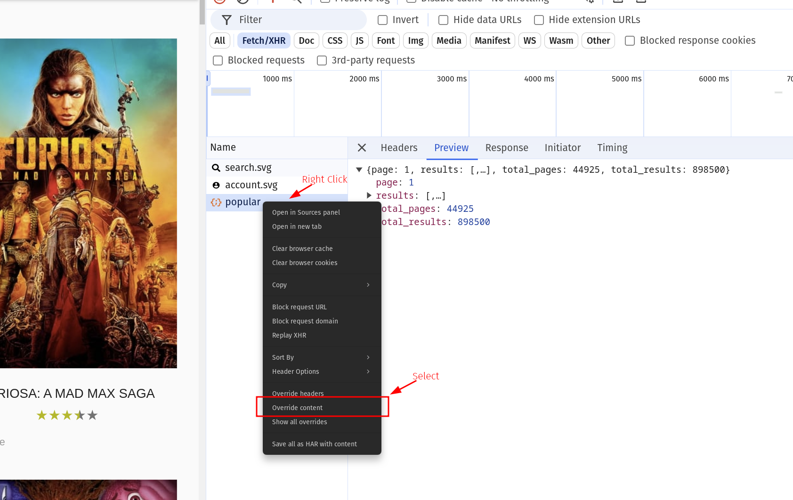

# Exercise: HttpInterceptors

In this exercise you will get to know another very useful tool of angulars `HttpClient`: `HttpInterceptor`s.
`HttpInterceptor`s allow you to define custom behavior which gets applied to any `HttpRequest` fired with the `HttpClient`.
This is especially useful for Errorhandling, Logging and Authentication.

## 1. Introduce ReadAccessInterceptor

Your task is to implement an `HttpInterceptor` which takes care of sending the required `Authorization` header whenever we want to
communicate with the `tmdb` api.

Generate a new interceptor `ReadAccessInterceptor`.

```bash
ng g interceptor read-access
```

The `Interceptor` should add `Authorization: 'Bearer ${environment.tmdbApiReadAccessKey}'` on each request being made.
For this, you want to return `next.handle` and use the `request.clone` method which allows you to `setHeader` the correct values.

If you don't read the solution, you may want to [read here](https://angular.io/guide/http#intercepting-requests-and-responses).

<details>
    <summary>Show Solution</summary>

```ts
// read-access.interceptor.ts

import { HttpInterceptorFn } from '@angular/common/http';

import { environment } from '../environments/environment';

export const readAccessInterceptor: HttpInterceptorFn = (req, next) => {
  return next(
    req.clone({
      setHeaders: {
        Authorization: `Bearer ${environment.tmdbApiReadAccessKey}`,
      },
    })
  );
};
```

</details>

Well done, in the next we are going to make use of the new Interceptor!

## 2. Use the readAccessInterceptor

After finishing the implementation, we need to tell the `HttpClient` to use it. Otherwise, our application
doesn't know about its existence and won't execute it at all.

Go to the `src/app/app.config.ts` file and configure the `provideHttpClient` provider function with
the `withInterceptors([])` feature. Use the `readAccessInterceptor` as input.

<details>
    <summary>configure `withInterceptors` feature</summary>

provide the `ReadAccessInterceptor` as `HTTP_INTERCEPTORS` in the `AppModule`

```ts
// app.config.ts
import { provideHttpClient, withInterceptors } from '@angular/common/http';
import { ApplicationConfig } from '@angular/core';
import { provideFastSVG } from '@push-based/ngx-fast-svg';

import { readAccessInterceptor } from './read-access.interceptor';

export const appConfig: ApplicationConfig = {
  providers: [
    provideHttpClient(withInterceptors([readAccessInterceptor])),
    /* other code */
  ],
};

```
</details>

> [!NOTE]
> Now that our interceptor is in place, we can remove the manual `header` configurations in all our
> http requests

```ts
// we don't need to configure the `header` manually anylonger

this.http
  .get<{ results: TMDBMovieModel[] }>(`${tmdbBaseUrl}/3/movie/popular`, {
    headers: {
      Authorization: `Bearer ${tmdbApiReadAccessKey}`,
    },
  });

// refactor to:

this.http.get<{ results: TMDBMovieModel[] }>(`${tmdbBaseUrl}/3/movie/popular`);
```

Serve the application. Make sure the movie values are still being shipped properly.
Double-check in the network tab if the header is still set and the result is still a valid movie list response.

## 3. (BONUS Exercise) ErrorInterceptor

> [!NOTE]
> This is a bonus exercise, you don't need to complete

Implement an interceptor which listens to the response of a request instead.
In case of an error, it should at least `console.error` a message.
In best case it would redirect the user to the `not-found` route when the error is of type `404`.
If you like, you can also send an `alert` to the user.

When u are done implementing it, try to produce an error. You could manipulate the http request responses with the help
of the devtools.



useful resources:
* [blog post](https://dev.to/this-is-angular/angular-error-interceptor-12bg)
* [docs](https://angular.io/guide/http#intercepting-requests-and-responses)
* [alert](https://developer.mozilla.org/de/docs/Web/API/Window/alert)
